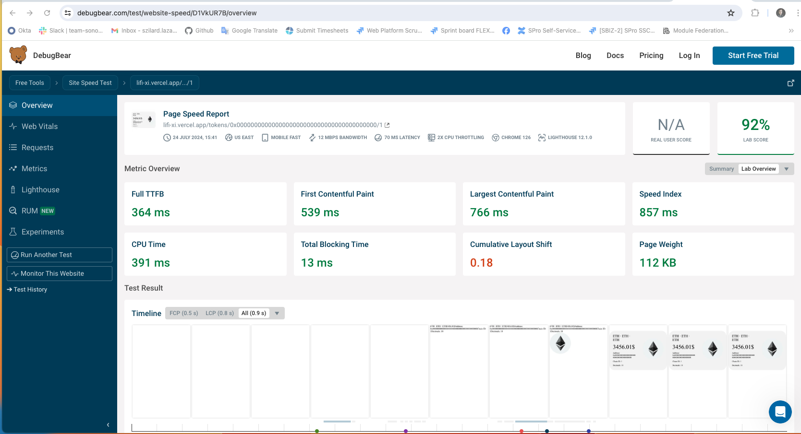
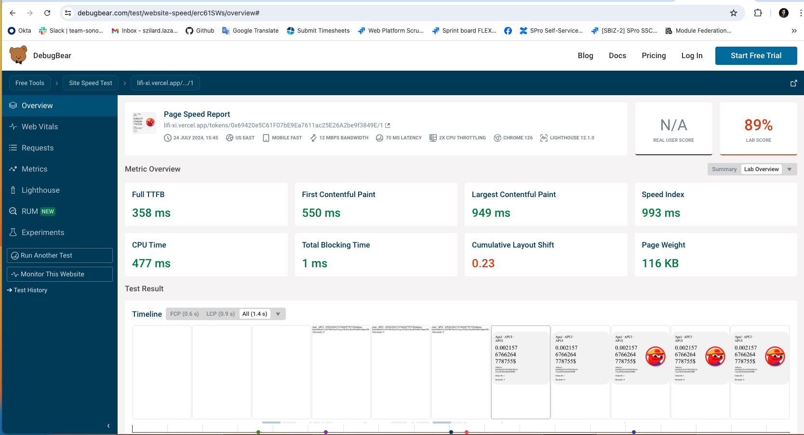

## Getting Started

To get started, clone the repository, install the dependencies, and run the development server. The following example uses PNPM (my chosen one):

```bash
git clone https://github.com/lsim1447/lifi.git

pnpm install

pnpm dev

```

Open [http://localhost:3000](http://localhost:3000) with your browser to see the result - `General Website` on the `main` branch (1.1).

In order to see all the features, check out to the `feat/favorite` branch - `Favorite Tokens - 1.2` and open the same URL as above:

```bash
git checkout feat/favorite

pnpm install

pnpm dev

```

## Architectural choices

### Features

- Overview Page:
  - Displays a searchable list of tokens. Each row shows the token name, token address, and token logo. Users can search for tokens.
- Detail Page:
  - Provides detailed information about a token. Includes a button to mark/unmark tokens as favorites.
- Favorite Tokens:
  - Users can mark tokens as favorites. Favorite tokens are displayed prominently on the Overview Page. Favorites persist across browser sessions using client-side state management.

The application utilizes an external API to fetch the required data/tokens. You can find the API endpoint and documentation here: [`https://apidocs.li.fi/reference/get_tokens`](https://apidocs.li.fi/reference/get_tokens).

### Technical Decisions

The application is built using `TypeScript` and styled-components for styling. It leverages `Server-Side Rendering (SSR)` and `Incremental Static Regeneration (ISR)` to ensure optimal performance and `SEO` benefits.

- `Next.js:`
  - Despite having the latest version installed, the app uses File-Based Routing (simplifies the creation of routes based on the file structure).
  - The reason behind this decision is very simple. I'm more comfortable with `Page Router` (right now). It was a personal decision, but if this would be a real/live project, I would have tried to go with `App Router` because it has a lot of advantages which could be beneficial. I'm amazed with the new features of the `App Router`. I've been working on POC-ing (investigating) it in case of my previous job/project, but we couldn't migrate the project at that point - it would have been too much work and the team decided to postpone it).
- `Styled-components:`
  - Again, a personal decision. I've been using `styled-components` with `React` back in the past and I wanted to see how does it work with `Next.js`. I really like the `CSS-in-JS` approach. It also allows for dynamic styling based on component props and to have 'scoped styling'. So far, I've been working mostly with `SCSS`, and `@vanilla-extract`. I was thinking between `styled-components` and `Tailwind CSS` (my other favorite).

#### Server-Side Rendering (SSR):

It's used by the main (Token Overview) page (`/`). It has SEO Benefits, ensures that content is available for search engine indexing. Provides faster initial load times by rendering pages on the server.

- `Challenge`: fetching the API on the server side caused the user to wait until the request fulfills. In case of the project the data what was coming from the API is huge. Rendering the entire list in the first place further slowed down the app.
  - Since the API does not support server-side filtering or pagination, optimising this part of the application was not possible. In order to somehow address this issue, I implemented a lazy-loading list logic to improve page load time. This contradicts the above a bit, but by doing this, the app renders only a few items initially and load additional items as the user scrolls down. I'd pay more attention to this in case of a real/live project.

#### Incremental Static Regeneration (ISR):

It's used by the Token Details page (`/token/<token.address>/<token.chainId>`).

- Up-to-Date Content: allows pages to be updated without a full site rebuild, ensuring content stays current (in case of a `price` change for example - right now it's being revalidated in every minutes). Combines the benefits of static generation and dynamic content updates.
- `Challenge:`
  - Pre-rendering the pages at build time didn't work as expected, because of the large number of the tokens coming from the API.
  - Pre-rendering all the detail pages (over 16,000) would significantly increase build times and exceed API call limits, causing the API to freeze. To mitigate these issues, only the first N pages are pre-built. The remaining pages are generated dynamically using the `fallback` option in `getStaticPaths`, allowing for on-demand rendering of pages not pre-rendered during the build.
  - The API limitations 'caused' another challenge/problem: since the main page contains a large token list, with a link on each item, for navigating to the Token Details page(s). `Next.js` attempted to prefetch these links, causing the API to freeze again. To resolve this, I disabled the prefetching feature.

## Development process - performance perspective

### Home page - Token Overview

The API returns a large dataset with thousands of tokens, making it data-heavy. We fetch this data on the server side, using `getServerSideProps`, which takes some time and it is postponing the initial load of the page (something to revisit again).

Rendering thousands of list items initially slowed down the application significantly. Below are images from our page performance tests showing the impact:


Here are the performance results after implementing lazy-loading:


### Token Detail Page

The `TokenDetailPage` component displays detailed information about a specific token. This page is statically generated using `Next.js`'s `getStaticProps` and `getStaticPaths` functions, ensuring optimised performance and scalability.

Rationale for Using getStaticProps and getStaticPaths:

- `getStaticPaths:` it allows us to specify dynamic routes that need to be pre-rendered at build time. By fetching the token list and generating paths for each token, we ensure that the first token detail pages are pre-rendered and cached. Pre-rendering pages reduces the load on the server, leading to faster page load times and improved user experience. Only the specified paths are pre-rendered, and additional paths are generated as needed with a fallback mechanism.
- `getStaticProps:` Static Generation with Data Fetching: getStaticProps fetches token data at build time for each path generated by getStaticPaths. This approach ensures that the token details page is statically generated, which results in faster load times. By using ISR with `revalidate: 60`, the page is regenerated every 60 seconds. This approach allows the data to stay fresh (like price changes) without requiring a full rebuild, combining the benefits of static generation and server-side rendering.

Note: We are currently pre-rendering the first 100 token detail pages due to API rate limitations encountered when fetching each token sequentially. This issue may be addressed in future updates.

Here are the performance results with a pre-rendered and a not pre-rendered page:



## Deployed version on Vercel

You can access the main version (1.1) of the app by visiting: [`https://lifi-xi.vercel.app`](https://lifi-xi.vercel.app).
