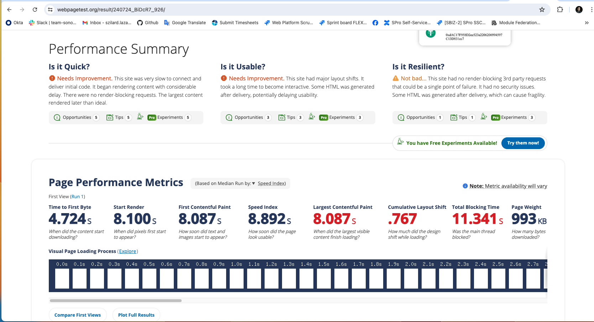
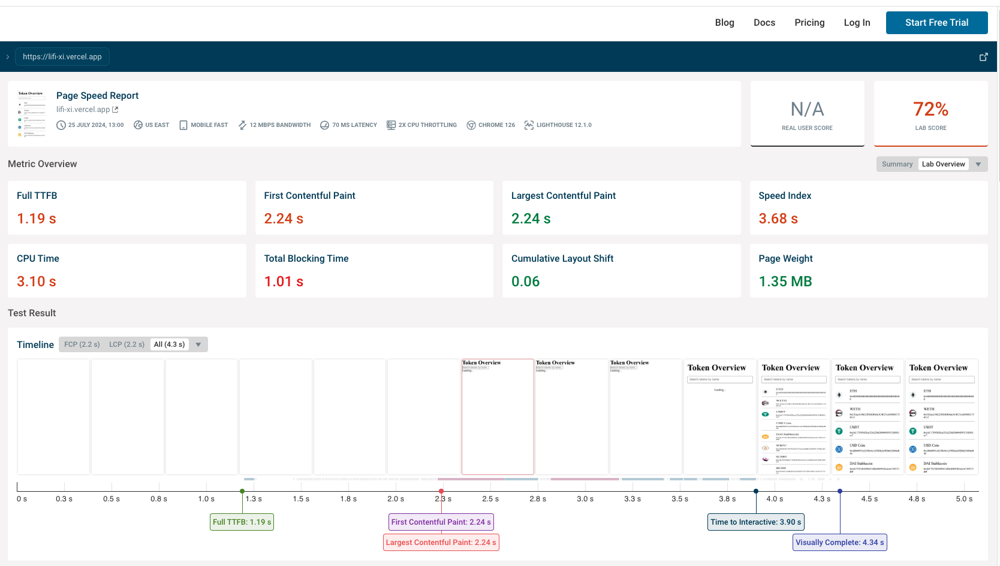
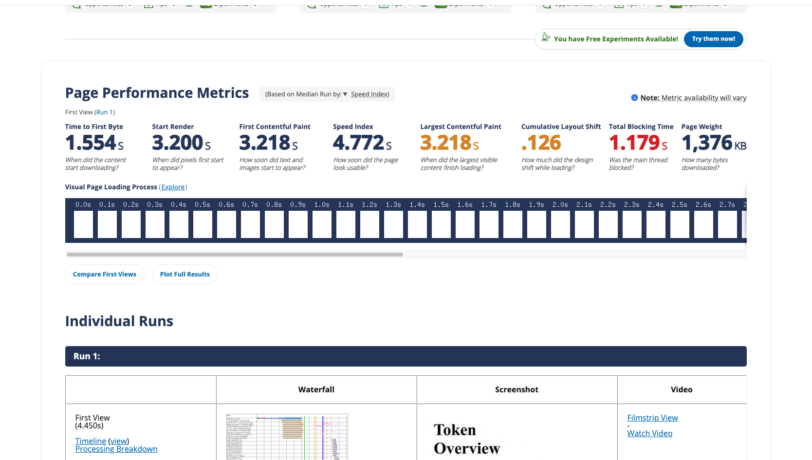

This is a [Next.js](https://nextjs.org/) project bootstrapped with [`create-next-app`](https://github.com/vercel/next.js/tree/canary/packages/create-next-app).

## Getting Started

To get started, clone the repository, install the dependencies, and run the development server. The following example uses PNPM (our chosen one):

```bash
git clone https://github.com/lsim1447/lifi.git

pnpm install

pnpm dev

```

Open [http://localhost:3000](http://localhost:3000) with your browser to see the result.

You can start editing the page by modifying `pages/index.tsx`. The page auto-updates as you edit the file.

## Learn More about the Token Overview & performance

### Home page - Token Overview

The application utilizes an external API to fetch the required data/tokens. You can find the API endpoint and documentation here: [`https://apidocs.li.fi/reference/get_tokens`](https://apidocs.li.fi/reference/get_tokens). The API returns a large dataset with thousands of tokens, making it data-heavy. We fetch this data on the server side using `getServerSideProps`, which can take some time.

Rendering thousands of list items initially slowed down the application significantly. Below are images from our page performance tests showing the impact:



Since the API does not support server-side filtering or pagination, we couldn't optimize this part of our application. To address this, we implemented a lazy-loading list logic to improve page load time. By doing this, we only render a few items initially and load additional items as the user scrolls down.

Here are the performance results after implementing lazy-loading:



### Token Detail Page

The TokenDetailPage component displays detailed information about a specific token. This page is statically generated using Next.js's `getStaticProps` and `getStaticPaths` functions, ensuring optimized performance and scalability.

Rationale for Using getStaticProps and getStaticPaths:
- `getStaticPaths:` it allows us to specify dynamic routes that need to be pre-rendered at build time. By fetching the token list and generating paths for each token, we ensure that the most popular token detail pages are pre-rendered and cached. Pre-rendering pages reduces the load on the server, leading to faster page load times and improved user experience. Only the specified paths are pre-rendered, and additional paths are generated as needed with a fallback mechanism.
- `getStaticProps:` Static Generation with Data Fetching: getStaticProps fetches token data at build time for each path generated by getStaticPaths. This approach ensures that the token details page is statically generated, which results in faster load times. By using ISR with revalidate: 20, the page is regenerated every 20 seconds. This approach allows the data to stay fresh (like price changes) without requiring a full rebuild, combining the benefits of static generation and server-side rendering.

Note: We are currently pre-rendering the first 100 token detail pages due to API rate limitations encountered when fetching each token sequentially. This issue may be addressed in future updates.

## Deployed version on Vercel
You can access the main version of the app by visiting: [`https://lifi-xi.vercel.app`](https://lifi-xi.vercel.app).
